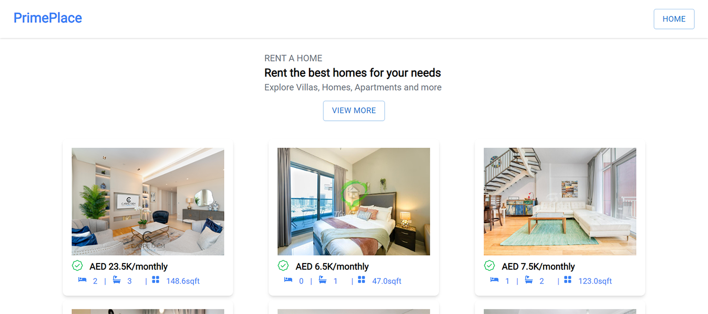
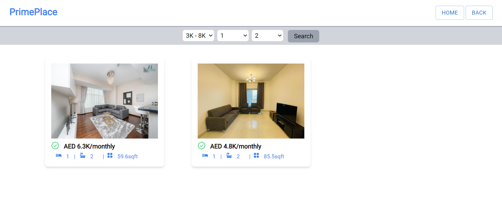

# PrimePlace, a real estate website implemented with RapidAPI's

## Uses Bayut API from RapidAPI's website to get real estate data from API calls and display estates on rent and for sale

## [View the website live](https://prime-place.netlify.app)

This project is a website built for practicing and utilizing data from API calls, and displaying them on the frontend for to the user to see. The website was made using these steps

<p align="center">
    
</p>

- fetching the data from the Bayut API after registering on the site
- loading that data and storing it into redux store
- redux persist is used to rehydrate the Redux store across page reloads or restarts
- only rerendering the API call if the redux store is empty to prevent unnecessary API calls, as the Bayut API has limited calls per month (500 fixed)
- two calls are made to the API, the first one to estates on rent and the second to estates on sale which are then displayed to the user
- routing for multiple pages to show home, rent estates and estates for sale done using react-router-dom
- If an estate is clicked it leads to another page that gives description of the estate
  
<p align="center">
    
</p>

- Search option added for rent estates and estates for sale that let you filter estates based on price, rooms, and baths

<p align="center">
    
</p>

- Test cases written with jest

## Technologies Used

- [](https://reactjs.org/)
- [](https://redux.js.org/)
- [](https://tailwindcss.com/)
- [](https://mui.com/)
- [](https://axios-http.com/)
- [](https://jestjs.io/)


## Click on the image to watch a video demo of the website!

<p align="center">
  <a href="https://youtu.be/bCp-hb7S_us" target="_blank">
    
  </a>
</p>

## How to get the project working on your device

- clone the repository
   ```sh
   git clone https://github.com/your_username_/Project-Name.git
   ```
- navigate to the project directory and install all dependencies
  ```sh
   npm install
   ```
- create an account on rapid API
- go to the Bayut API and subscribe to it [Bayut API](https://rapidapi.com/apidojo/api/bayut)
- copy your API key and replace it with the API key currently in the project
- run the project
   ```sh
     npm start
     ```

## Important Notes

- if the site takes time to load sometimes its because of its high latency mentioned in the site (1,712ms)
- if on starting no data is rendered it would be because the monthly quota of 500 requests(fixed) have been used up
